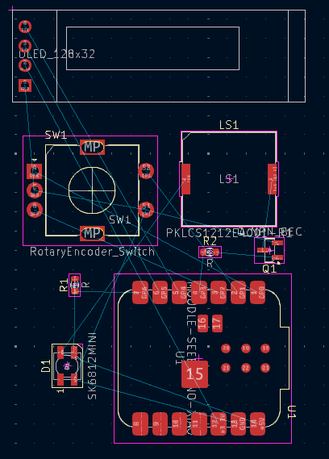
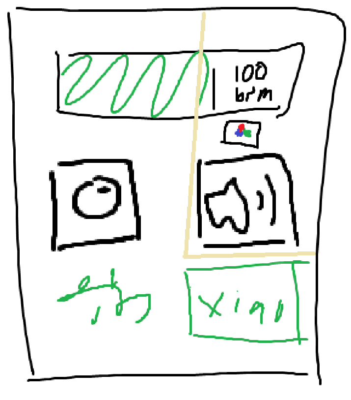
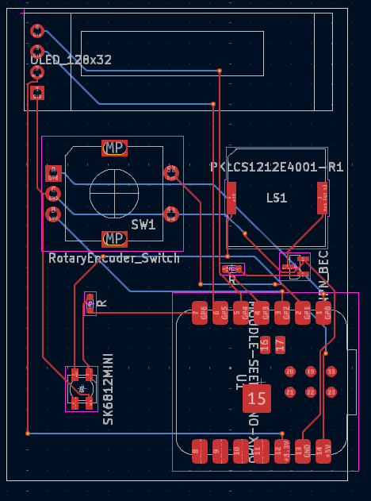
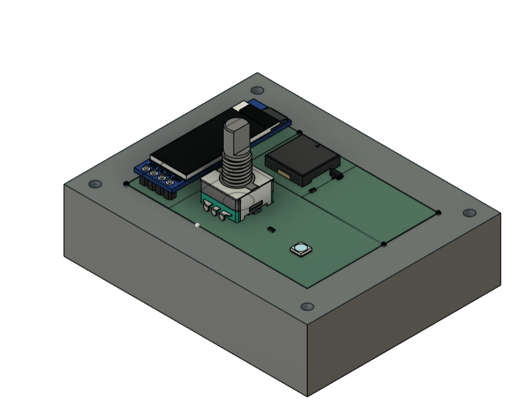
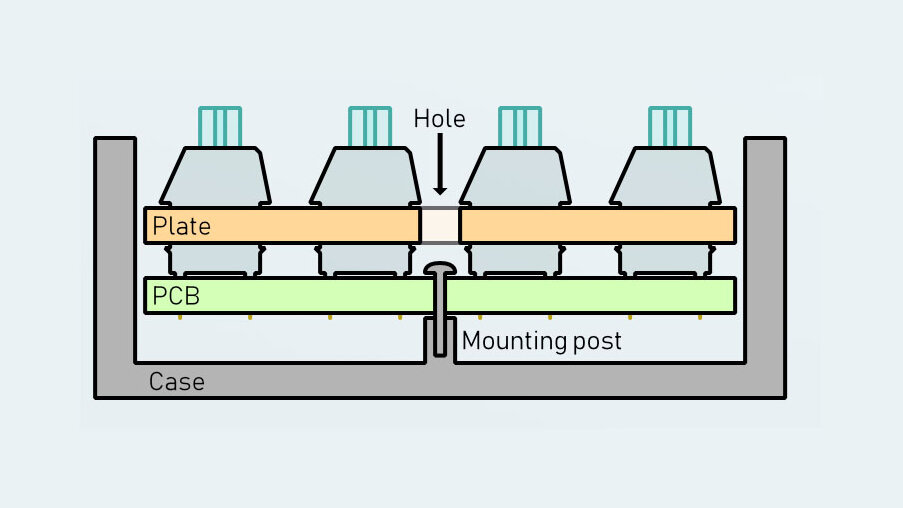
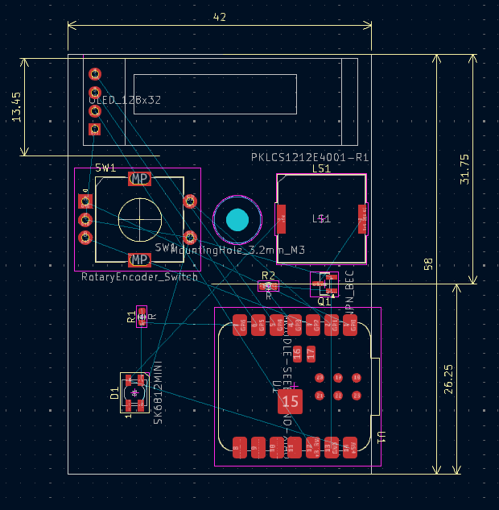
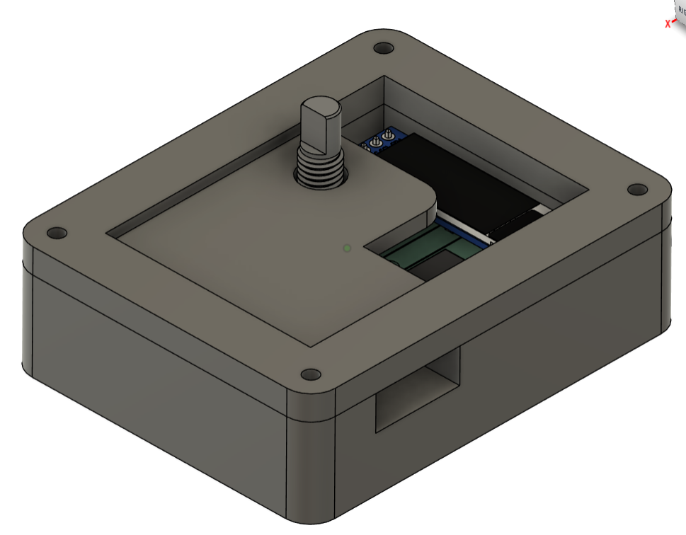
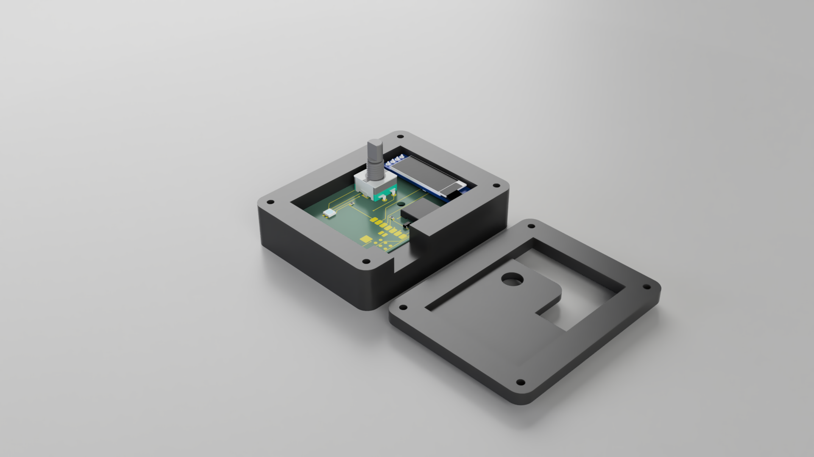
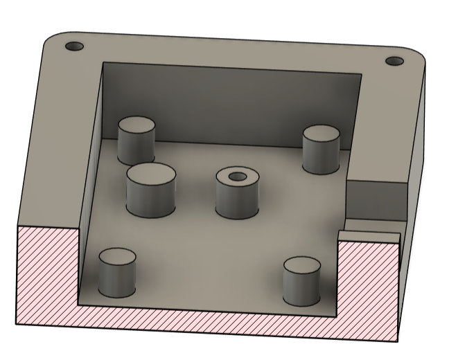
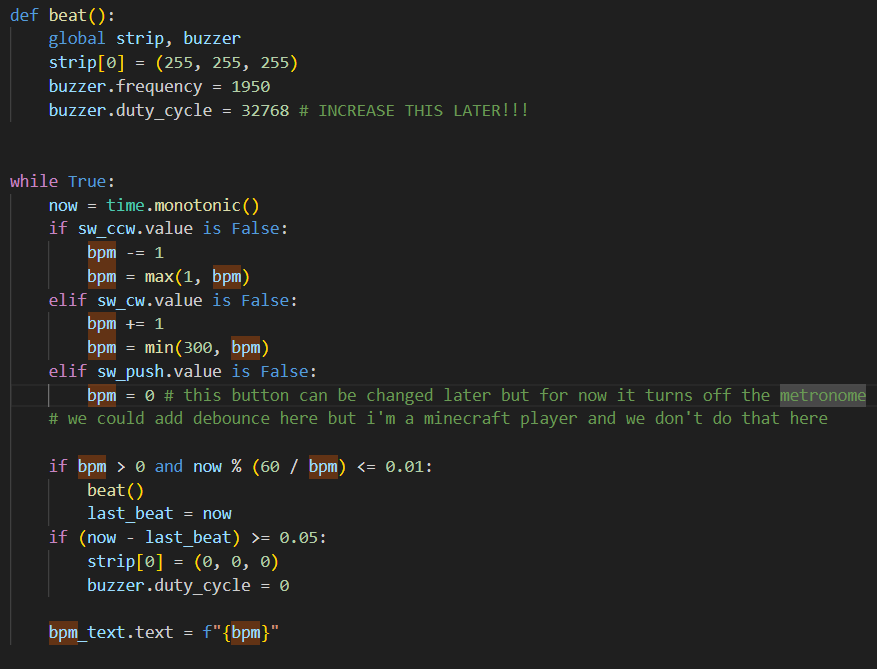

## June 4th, 2025, 6:32 PM 
I have a vision for where I want to take this project, but since I have finals tomorrow i'll just get a basic schematic whipped up (i have no idea what i'm doing) 
**literally like 30 seconds spent 😭**

## June 9th, 2025, 3:17 PM 
I did not in fact get anything done but finals are over so i can probably actually get started today 
hear me out tabletop flat design cause i'm scared of 90°, plate for mx switches and an oled cause i'm overconfident, but first let's get a basic pcb done 
wait no hear me out: rotary encoder. to encode your rotary movement. amirite amirite? 
**1 hour spent**

## June 12th, 2025, 9:01 PM 
ok time to wire up the oled and rotary encoder 
zawg how do i power ts 
ohhhh now i know the difference between vsys, vbus, and 3v3 
it's all wired in the schematic :yay: 
now time to find a speaker that's loud and preferably not expensive (good cheap fast ahh) 
oops i had the times i spent written in obsidian but not here better add those in 
alr i got a somewhat coherent schematic together i'm going to sleep now 
**2 hours spent** 

## June 13th, 2025 12:04 PM 
if you're reading the actual markdown for some reason i must apologize for the way i format this 
so i want to put an led on here for visual feedback 
i could use just a single led or i could use a neopixel :wow: 
i think for the led i could just give it power every x ms and put a resistor in front of it 
after further research, i've decided to just use a single neopixel 
time to go back to the schematic 
**1 hour spent 😭** 

## June 15th, 2025 4:30 PM 
i guess it's time to pcb all over the place 
nvm my schematic has issues 
so i guess it's better to power oled with 3v3 
and my neopicel wasn't connected to anything somehow 
also i guess the buzzer should also use 3v3, honestly the buzzer is what i'm most worried about 
schematic should be finished now, it looks so tuff 

oh i guess the pins for the buzzer symbol don't match the ones on the footprint, i guess i should just reassign them 
**2 hours spent**

## June 18th, 2025 1:12 PM 
i fixed the buzzer and made a basic outline of how i want it on paper and on the pcb 
 
 
**1 hour spent**

## June 22nd, 6:32 PM 
got pcb outline finished and wired

**1 hour spent**

## June 29th, 7:30 PM 
ok i should run git push i've been editing ts locally this whole time 😭 
anyway i'm locking in now to make the case 
okay i think it'll be more stable if i make a round cutout for the rotary encoder instead of just having it completely exposed 
and i should also have a square border that is actually connected to the "plate" to give it some more stability 
 
wait i was going to sandwich mount it like a keyboard but i don't have mx switches, just a rotary encoder 
how do i mount ts 😭 
**3 hours spent**

## June 30th, 2:34 PM 
i thought about it and i looked at the mounting styles website and i think if i make a kind of tray mount style case it'll be fine 

so in my case the "plate" doesn't hold up the pcb in any way, it's just to cover and protect the pcb, so i'll have a couple more posts in the corners to hold it up, and probably something under the encoder to give it stability 
i made some slight adjustments to the pcb to give the screw a bit of clearance 
 
ok i'll just edit my sketch and go to sleep
**2 hours spent**

## July 1st, 3:22 PM 
i want to get ts finished today, luckily it's just continuing manual labor from yesterday  
okay i got the case put together  
  
so this is in two pieces, the bottom case and a top covering.  
  
there's a hole for the rotary encoder, and another hole on the side for power delivery to the xiao  
the pcb is held up with supports at the bottom of the case. there's a "post" in each corner, plus one directly under the rotary   encoder and one approximately in the middle to screw into.  
  
agh i forgot firmware see you tomorrow  
**2 hours spent**

## July 2st, 1:10 PM 
okay firmware should be pretty simple. i think i can even get away with using qmk cause that's what i'm familiar with  
ok so i am definitely not using qmk  
after much research and docs reading, i think i got a probably working firmware:  
  
you change the bpm with the rotary encoder, and push on it to turn off the metronome  
when a beat happens, the piezo buzzer chirps and the neopixel flashes  
yeah that's pretty much it :heavysob:  
thanks for reading make sure to like and subscribe  
**3 hours spent**