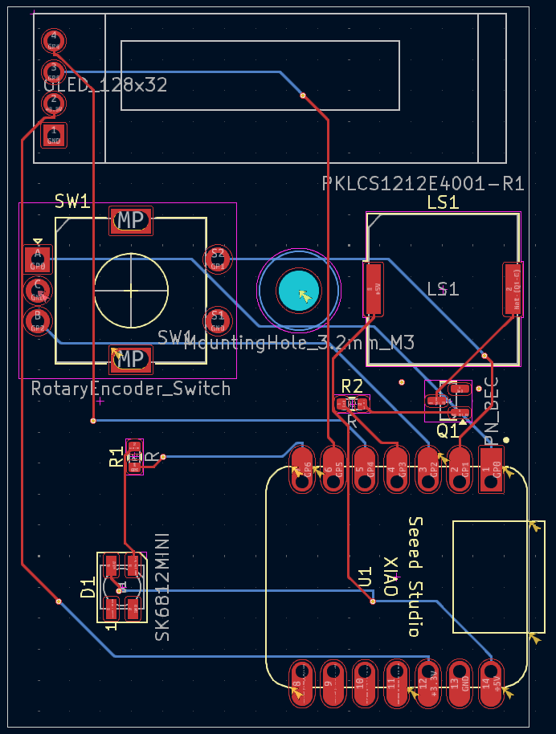

## Yet Another Metronome by Sreekar  

Usually when I'm practicing my violin, I like to do a lot of metronome work to keep myself on tempo. However, neither my phone nor my laptop can be heard above the sound of the violin, and it's generally not a good idea to practice quieter because you practice the way you perform.  

Up until this point, my solution was to use the metronome on a Roland Digital Piano, since they're super loud and available for use at my school, where I do most of my practice. The problem is, I don't always practice in the practice rooms, and even then, the rooms with the piano aren't always available.  

My solution is to make a small, portable metronome that can stil get loud enough to hear over my violin playing. The device contains a piezo buzzer, a single Neopixel for visual feedback, an OLED to see the current BPM, and a rotary encoder to change the BPM. To keep things light and small, it's powered by a XIAO RP2040. 

PCB                             |  PCB + Case
:------------------------------:|:---------------------------------:
| 

BOM:
| Id | Designator | Footprint                                      | Quantity | Designation           | Supplier and ref | Link                                                                     |
| -- | ---------- | ---------------------------------------------- | -------- | --------------------- | ---------------- | ------------------------------------------------------------------------ |
| 1  | D1         | LED_SK6812MINI_PLCC4_3.5x3.5mm_P1.75mm         | 1        | SK6812MINI            | C5149201         | https://jlcpcb.com/partdetail/OPSCOOptoelectronics-SK6812MINIE/C5149201  |
| 2  | Q1         | SOT-23                                         | 1        | Q_NPN_BEC             | C2150            | https://jlcpcb.com/partdetail/2507-SS8050_RANGE_200_350/C2150            |
| 3  | J1         | OLED_128x32                                    | 1        | OLED_128x32           | C5248081         | https://jlcpcb.com/partdetail/HS-HS91L02W2C01/C5248081                   |
| 4  | SW1        | RotaryEncoder_Alps_EC11E-Switch_Vertical_H20mm | 1        | RotaryEncoder_Switch  | C202365          | https://jlcpcb.com/partdetail/ALPSALPINE-EC11E18244AU/C202365            |
| 5  | R1         | R_0603_1608Metric                              | 1        | 300Ω                  | C23025           | https://jlcpcb.com/partdetail/23752-0603WAF3000T5E/C23025                |
| 6  | R2         | R_0603_1608Metric                              | 1        | 1000Ω                 | C51218           | https://jlcpcb.com/partdetail/52231-0603WAD1001T5E/C51218                |
| 7  | U1         | XIAO-Generic-Hybrid-14P-2.54-21X17.8MM         | 1        | MOUDLE-SEEEDUINO-XIAO |                  | https://www.seeedstudio.com/XIAO-RP2040-v1-0-p-5026.html                 |
| 8  | LS1        | Buzzer_Murata_PKLCS1212E                       | 1        | PKLCS1212E4001-R1     | C113159          | https://jlcpcb.com/partdetail/MurataElectronics-PKLCS1212E4001R1/C113159 |
| 9  | --         | --                                             | 4        | M3x20mm Screws        | Generic          | Source locally                                                           |
| 10 | --         | --                                             | 1        | M3x12mm Screw         | Generic          | Source locally                                                           |
| 11 | --         | --                                             | 5        | M3 Nuts               | Generic          | Source locally                                                           |
| 12 | --         | --                                             | 1        | Bottom Case           | Generic          | Print with Legion                                                        |
| 13 | --         | --                                             | 1        | Top Case              | Generic          | Print with Legion                                                        |
| 14 | --         | --                                             | 1        | PCB                   | JLCPCB           | Order from JLCPCB                                                        |
